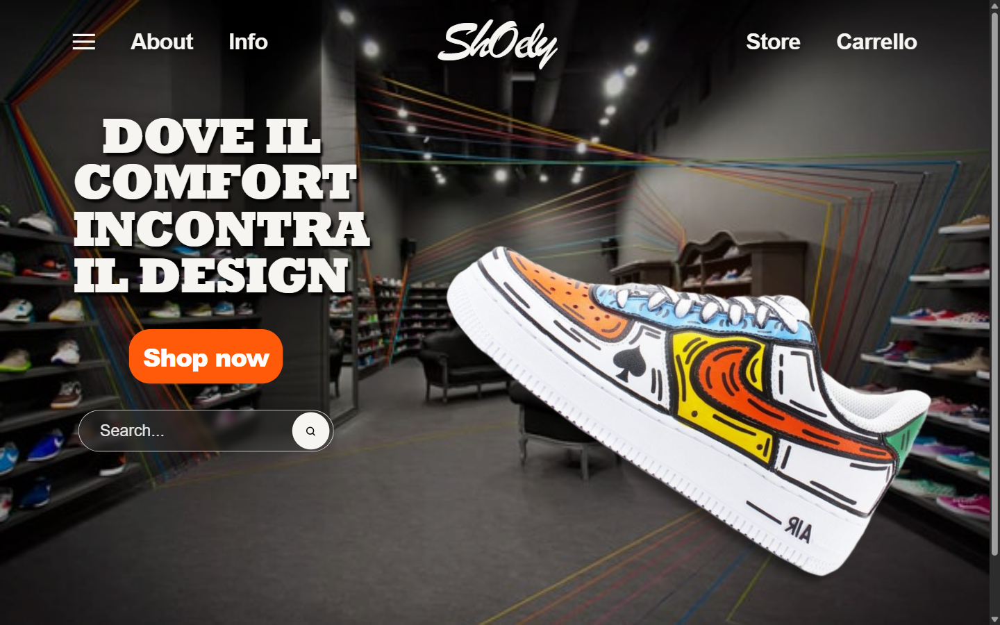
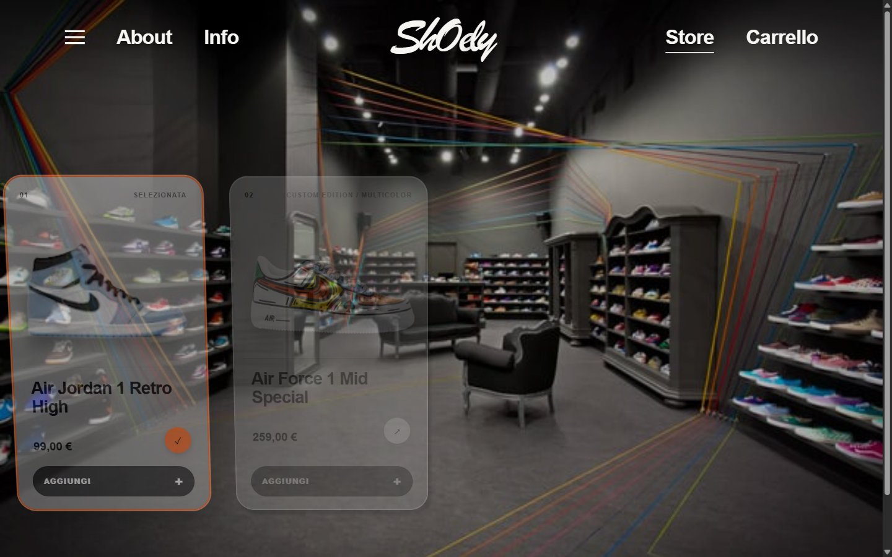

# Shoes M.V. — 3D Sneaker Store

Shoes M.V. è un concept e-commerce dedicato alle sneaker, nato come progetto UI/UX
in Figma e successivamente trasformato in un sito React responsive e
funzionante. Il progetto mantiene l'atmosfera del prototipo originale e la
combina con una scena Three.js predisposta per modelli GLB, interazioni leggere
e transizioni GSAP.

## Collegamenti

- [Demo online](https://vincenzomec97-ship-it.github.io/shoely-3d-store/)
- [Prototipo Figma Shoes](https://www.figma.com/proto/G09Tq8i37addPsCe293DVz/Untitled?node-id=2-2)
- [Portfolio](https://vincenzomec97-ship-it.github.io/VinMec-portfolio/)

> La demo GitHub Pages diventa disponibile dopo il primo deploy del branch
> `main`.

## Anteprima





## Obiettivo

L'obiettivo è mostrare come un'esperienza prodotto cinematografica possa
convivere con una landing page responsive, accessibile e utilizzabile anche
quando gli asset 3D non sono disponibili.

Il progetto è pensato come dimostrazione frontend per portfolio. Non costituisce
un negozio reale.

## Caratteristiche principali

- Hero responsive fedele all'atmosfera del riferimento Figma.
- Scena Three.js caricata in modo lazy e predisposta per modelli GLB.
- Fallback grafico locale quando non è disponibile un modello 3D.
- Movimento leggero della sneaker e interazione con il puntatore su desktop.
- Transizione originale tra hero e catalogo tramite GSAP e ScrollTrigger.
- Quattro prodotti selezionabili con configurazioni visive differenti.
- Ricerca in tempo reale per nome e sottotitolo.
- Card responsive con stato attivo, hover e focus visibile.
- Carrello dimostrativo lato client con quantità, totale e persistenza locale.
- Drawer del carrello e menu mobile accessibili.
- Supporto per `prefers-reduced-motion`.
- Metadata SEO e social sharing, sitemap e robots.
- Pubblicazione automatizzata tramite GitHub Pages.

## Tecnologie

- React
- Vite
- JavaScript
- CSS
- Three.js
- React Three Fiber
- Drei
- GSAP
- ScrollTrigger
- `@gsap/react`

Three.js è installato come dipendenza npm. La repository ufficiale non è
inclusa né clonata nel progetto.

## Struttura del progetto

```text
shoely-3d-store/
├── public/
│   ├── images/                 # Immagini e illustrazioni pubbliche
│   └── models/                 # Modelli GLB opzionali
├── references/
│   └── shoely-figma-reference.png
├── src/
│   ├── assets/
│   │   ├── icons/
│   │   └── textures/
│   ├── components/
│   │   ├── layout/             # Header, menu mobile e footer
│   │   ├── sections/           # Hero e catalogo prodotti
│   │   ├── three/              # Canvas, scena, modello, luci e fallback
│   │   └── ui/                 # Card, ricerca, carrello e pulsanti
│   ├── context/                # Stato prodotti e carrello
│   ├── data/
│   │   └── products.js         # Catalogo e configurazione prodotti
│   ├── hooks/                  # Responsive 3D, motion e reduced motion
│   ├── styles/                 # Reset, variabili e stili globali
│   ├── utils/                  # Configurazione GSAP
│   ├── App.jsx
│   └── main.jsx
├── index.html
├── package.json
└── vite.config.js
```

## Installazione

Requisiti:

- Node.js compatibile con la versione di Vite installata;
- npm.

Installa le dipendenze dalla radice del progetto:

```bash
npm install
```

## Avvio locale

```bash
npm run dev
```

Vite mostrerà nel terminale l'indirizzo locale da aprire nel browser.

## Build di produzione

```bash
npm run build
```

La build ottimizzata viene generata nella cartella `dist/`.

Per provarla localmente:

```bash
npm run preview
```

## Gestione degli asset

- Le immagini utilizzate dall'interfaccia si trovano in `public/images/`.
- I modelli 3D devono essere inseriti in `public/models/`.
- Il riferimento progettuale si trova in `references/` e non viene importato
  direttamente dall'applicazione.
- Il sito non dipende da immagini remote o API esterne.
- Lo sfondo e la sneaker della hero dispongono di copie locali.

Prima di pubblicare il progetto è necessario verificare licenze, diritti
d'utilizzo e presenza di marchi riconoscibili in ogni immagine o modello.

## Sostituzione dei modelli GLB

Il modello condiviso di fallback può essere aggiunto come:

```text
public/models/sneaker.glb
```

Sono inoltre supportati modelli specifici per prodotto:

```text
public/models/aero-one.glb
public/models/street-force.glb
public/models/pulse-runner.glb
public/models/cloud-motion.glb
```

Il percorso associato a ogni prodotto è definito in `src/data/products.js`.
Durante l'avvio o la build, `vite.config.js` verifica quali file sono presenti.
Se il modello specifico manca, viene cercato `sneaker.glb`; se manca anche
questo, la hero utilizza il fallback grafico locale.

Dopo aver aggiunto o sostituito un GLB, riavvia il server Vite affinché la
disponibilità venga rilevata nuovamente.

Per adattare un nuovo modello, i valori principali si trovano in:

- `src/components/three/ShoeScene.jsx`: posizione, rotazione e scala;
- `src/hooks/useResponsiveThree.js`: camera e DPR;
- `src/components/three/SceneLights.jsx`: illuminazione;
- `src/components/three/ShoeModel.jsx`: caricamento e clonazione del GLTF.

È consigliato utilizzare modelli ottimizzati per il web, con materiali
compatibili con Three.js e texture proporzionate all'uso effettivo.

## Modifica dei prodotti

Il catalogo è configurato in `src/data/products.js`. Ogni prodotto contiene:

```js
{
  id,
  name,
  subtitle,
  price,
  image,
  model,
  accentColor,
  description,
}
```

Per aggiungere o modificare un prodotto:

1. inserisci l'immagine in `public/images/`;
2. inserisci l'eventuale GLB in `public/models/`;
3. aggiorna l'array esportato da `src/data/products.js`;
4. se usi un nuovo percorso GLB, aggiungilo anche all'elenco controllato in
   `vite.config.js`;
5. riavvia il server di sviluppo.

I prezzi sono numerici e vengono formattati in euro tramite
`Intl.NumberFormat`.

## Accessibilità

Il progetto include:

- navigazione da tastiera;
- focus visibile;
- label accessibile per la ricerca;
- stati `aria-pressed` sulle card selezionabili;
- menu mobile e carrello con semantica dialog;
- chiusura tramite Escape e overlay;
- focus iniziale e restituzione del focus al controllo di apertura;
- focus contenuto nei pannelli aperti;
- blocco dello scroll quando un pannello è attivo;
- testi alternativi o immagini decorative marcate correttamente;
- supporto per `prefers-reduced-motion`.

Con reduced motion, le animazioni complesse e l'interazione della sneaker
vengono disattivate o semplificate, mantenendo disponibili i contenuti.

## Prestazioni

Le ottimizzazioni presenti includono:

- caricamento lazy del modulo Three.js della hero;
- Canvas non montato quando nessun GLB è disponibile;
- DPR limitato e ulteriormente ridotto su mobile;
- antialias disattivato su mobile;
- ombre semplificate su mobile;
- `ContactShadows` limitato al desktop e calcolato una sola volta;
- shadow map principale da 512px;
- configurazioni e proprietà 3D memoizzate;
- nessun preload del GLB in assenza di un beneficio concreto;
- frame loop su richiesta quando è attivo reduced motion;
- cleanup di listener, timeline GSAP e ScrollTrigger.

Non vengono dichiarati punteggi Lighthouse, frame rate o tempi di caricamento:
questi valori dipendono da dispositivo, browser, rete e soprattutto dai modelli
GLB eventualmente aggiunti.

## Limitazioni

- Non sono inclusi modelli GLB nel repository allo stato attuale.
- Il carrello è dimostrativo e viene salvato soltanto in `localStorage`.
- Non sono presenti backend, database, autenticazione o sincronizzazione tra
  dispositivi.
- Non sono implementati pagamenti o checkout reale.
- La ricerca opera soltanto sul catalogo locale.
- Disponibilità, prezzi e inventario non provengono da un sistema commerciale.
- L'esperienza 3D finale dipende dalla qualità e dall'ottimizzazione dei GLB
  aggiunti successivamente.

## Disclaimer

Shoes M.V. è un progetto concept realizzato esclusivamente per portfolio e
dimostrazione tecnica.

Il progetto non è affiliato, sponsorizzato o approvato da Nike o da altri
marchi. Eventuali immagini o riferimenti commerciali devono essere sostituiti o
utilizzati soltanto dopo aver verificato i relativi diritti.

Lo stile WebGL, le interazioni, le transizioni e l'implementazione del progetto
sono originali. Eventuali riferimenti ad altri siti riguardano esclusivamente
l'ispirazione tecnica, come fluidità, profondità, uso dello scroll e qualità
delle transizioni; non implicano la copia di codice, grafica, testi, modelli 3D
o strutture proprietarie.
